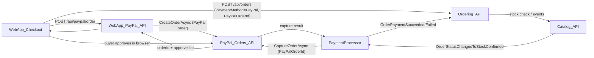

# PayPal Checkout Integration Plan

## Goals

- **Primary**: Implement a minimal, production-ready PayPal checkout that lets users pay with a PayPal account only (no cards, Venmo, vaulting, or PayPal order updates) using the PayPal Server SDK in C#.
- **Integration**: Plug the new flow into existing eShop components: WebApp checkout UI, Ordering API/domain, and keep current card/PaymentProcessor flows working. No mobile client needed.

## High-Level Architecture

- **Frontend (WebApp)**: Add a PayPal payment option on checkout and integrate the PayPal JS SDK for browser approval.
- **Backend (WebApp)**: Expose a PayPal-specific endpoint that:
  - Uses the PayPal Server SDK to **create** a PayPal order from the user’s basket and return the approval link and `paypalOrderId`.
  - Does **not** capture the payment; instead, it stores or returns the `paypalOrderId` so it can be sent to `Ordering.API` after approval.
- **Ordering.API / Domain**: Extend request and domain models to understand a PayPal payment type, store PayPal identifiers, and create the order in an unpaid state that will still go through the normal stock‑validation pipeline.
- **PaymentProcessor**: After `OrderStatusChangedToStockConfirmedIntegrationEvent`, use the PayPal Server SDK to **capture** the payment for PayPal orders and publish success/failure events; if stock is not confirmed, capture is never called.

## Step 1: Configure PayPal SDK and Settings in WebApp

- **Packages**
  - Add the PayPal Server SDK NuGet package to the WebApp project:
    - `PayPalServerSDK` (version as per official docs/your environment).
- **Configuration**
  - In `appsettings.Development.json` and `appsettings.json` of WebApp, add a `PayPal` section with:
    - `ClientId`
    - `ClientSecret`
    - `Environment` (e.g., `Sandbox`, `Live`)
  - Create a strongly-typed options class, e.g. `PayPalOptions`, and bind it in `Program.cs` of WebApp.
- **Client registration**
  - In WebApp startup, register a `PaypalServerSdkClient` and an abstraction like `IPayPalCheckoutService` in DI, using the sample builder pattern from the SDK:
    - Use `ClientCredentialsAuthModel` with values from `PayPalOptions`.
    - Configure `Environment.Sandbox` for development, `Environment.Live` for production.
    - Enable reasonable logging and HTTP timeouts.

## Step 2: Implement PayPal Checkout Service (Server-side)

- **Location**: Add a new service class in WebApp, e.g. `[src/WebApp/Services/Payments/PayPalCheckoutService.cs](src/WebApp/Services/Payments/PayPalCheckoutService.cs)`.
- **Interface**: Define `IPayPalCheckoutService` with a method like:
  - `Task<ApiResponse<Order>> CreateOrderForBasketAsync(string basketId, string userId)`
- **Implementation details** (using the official SDK patterns):
  - Use `OrdersController.CreateOrderAsync` with:
    - `OrderRequest.Intent = CheckoutPaymentIntent.Capture` (this only sets the **intent** of the order; it does not perform any capture).
    - `PurchaseUnits` built from the current basket’s items/total (via existing basket services in WebApp).
    - `Prefer = "return=representation"` to get full data back.
    - `PaypalRequestId` set to a deterministic idempotency key (e.g., `create-{localOrderOrBasketId}`).
  - Map the returned `Order.Id` (PayPal order ID) to the current basket/local order context in your own persistence (e.g., a small `PaypalCheckoutSession` table or reuse existing state mechanisms in WebApp) so that it can be sent along to `Ordering.API` after the buyer approves the payment in the browser.
  - Do **not** call `CaptureOrderAsync` or perform any capture logic here; the **only** place that will call `CaptureOrderAsync` is the PaymentProcessor service after stock has been confirmed (see Step 5).

## Step 3: Add PayPal-specific API Endpoints in WebApp

- **Location**: Add a small API surface in WebApp, e.g. `[src/WebApp/Apis/PayPalCheckoutApi.cs](src/WebApp/Apis/PayPalCheckoutApi.cs)` or a minimal-API region in `Program.cs`.
- **Endpoints**:
  - `POST /api/paypal/order`
    - Reads the current user identity and basket ID (via existing `BasketState` / `IBasketService`).
    - Calls `IPayPalCheckoutService.CreateOrderForBasketAsync(...)`.
    - Persists mapping between `paypalOrderId` and basket/user.
    - Returns JSON with:
      - `paypalOrderId`.
      - `approvalUrl` (extracted from the order’s `Links` where `rel == "approve"`).
  - After the buyer approves the PayPal order in the browser, the frontend will call the existing order-creation endpoint (e.g. `POST /api/orders` via `OrderingService`) and include:
    - `PaymentMethod = PayPal`.
    - The `paypalOrderId` (and any other PayPal metadata needed).
    - The order total and other checkout details.
  - The order created this way should still flow through stock validation; only after stock is confirmed will the PaymentProcessor capture the PayPal payment.

## Step 4: Extend Ordering.API & Domain for PayPal Metadata

- **Update API request models**
  - File: `[src/Ordering.API/Apis/OrdersApi.cs](src/Ordering.API/Apis/OrdersApi.cs)`
    - Extend `CreateOrderRequest` to include:
      - `PaymentMethod` (enum/string, e.g., `"Card"`, `"PayPal"`).
      - Optional `PayPalOrderId`.
    - Keep existing card fields for backward compatibility.
- **Update command layer**
  - File: `[src/Ordering.API/Application/Commands/CreateOrderCommand.cs](src/Ordering.API/Application/Commands/CreateOrderCommand.cs)`
    - Add the same `PaymentMethod` and `PayPalOrderId` fields and plumb them through to the handler.
  - File: `[src/Ordering.API/Application/Commands/CreateOrderCommandHandler.cs](src/Ordering.API/Application/Commands/CreateOrderCommandHandler.cs)`
    - When `PaymentMethod == PayPal`:
      - Create the `Order` without requiring card details.
      - Store PayPal IDs, but leave the order in an unpaid state so that it still goes through stock validation.
      - Ensure that the domain events which lead to `OrderStatusChangedToStockConfirmedIntegrationEvent` are raised so the PaymentProcessor can later capture the PayPal payment.
- **Update domain model**
  - File: `[src/Ordering.Domain/AggregatesModel/BuyerAggregate/PaymentMethod.cs](src/Ordering.Domain/AggregatesModel/BuyerAggregate/PaymentMethod.cs)`
    - Add support for a PayPal-type payment method that stores non-card metadata (e.g., PayPal order) instead of card number/expiration.
  - File: `[src/Ordering.Domain/AggregatesModel/BuyerAggregate/Buyer.cs](src/Ordering.Domain/AggregatesModel/BuyerAggregate/Buyer.cs)`
    - Ensure `VerifyOrAddPaymentMethod` handles PayPal methods gracefully (may not need to persist a reusable PayPal method if you’re doing one-off payments).
  - File: `[src/Ordering.API/Application/DomainEventHandlers/ValidateOrAddBuyerAggregateWhenOrderStartedDomainEventHandler.cs](src/Ordering.API/Application/DomainEventHandlers/ValidateOrAddBuyerAggregateWhenOrderStartedDomainEventHandler.cs)`
    - Branch logic based on `PaymentMethod` to avoid forcing card-specific validation for PayPal orders.

## Step 5: Implement PayPal Capture in PaymentProcessor After Stock Confirmation

- **Current state**
  - PaymentProcessor is a separate service that simulates payment success/failure based on `PaymentOptions.PaymentSucceeded`, driven by `OrderStatusChangedToStockConfirmedIntegrationEvent`.
- **Plan for PayPal**
  - Extend the integration event payload and/or look up the order so that the PaymentProcessor can access `PaymentMethod` and the `PayPalOrderId`.
  - In `OrderStatusChangedToStockConfirmedIntegrationEventHandler`, when the payment method is PayPal:
    - Use the PayPal Server SDK’s `OrdersController.CaptureOrderAsync` with the stored `PayPalOrderId`, and a suitable idempotency key, to capture the payment.
    - If capture succeeds, publish `OrderPaymentSucceededIntegrationEvent` as today.
    - If capture fails, publish `OrderPaymentFailedIntegrationEvent` so Ordering can cancel the order.
  - For card-based/test flows, keep the existing simulated behavior unchanged.
  - This ensures PayPal payments are only captured **after** stock has been confirmed; if stock is never confirmed, the handler is never invoked and the payment is never captured.

## Step 6: Update WebApp Checkout UI for PayPal

- **Location**: `[src/WebApp/Components/Pages/Checkout/Checkout.razor](src/WebApp/Components/Pages/Checkout/Checkout.razor)` and related services `[src/WebApp/Services/BasketState.cs](src/WebApp/Services/BasketState.cs)`, `[src/WebApp/Services/BasketCheckoutInfo.cs](src/WebApp/Services/BasketCheckoutInfo.cs)`.
- **Payment method selection**
  - Add UI controls to let the user choose between **Credit Card** and **PayPal**.
  - For the PayPal path, you do not need to collect card fields; hide or disable those inputs when PayPal is selected.
- **Integrate PayPal JS SDK**
  - Include the PayPal JS SDK script in the checkout page (e.g., via a script tag that uses a `client-id` value from configuration exposed to the client).
  - Implement a PayPal button that:
    - Calls `POST /api/paypal/order` to create a PayPal order and retrieve the `paypalOrderId`/`approvalUrl`.
    - Uses the SDK to send the shopper to PayPal for approval.
    - On `onApprove`, posts the checkout data to the existing order-creation path (e.g., via `BasketState.CheckoutAsync` / `POST /api/orders`), including `PaymentMethod = PayPal` and the `paypalOrderId`.
  - After the local order is created, navigate the user to the existing order confirmation/summary page; the PaymentProcessor will capture the PayPal payment asynchronously after stock has been confirmed.
- **Existing card flow**
  - Keep current card checkout logic as-is, but consider wiring it to use the form data in `BasketCheckoutInfo` instead of hardcoded card values for better realism.

## Step 7: Testing & Environment Hardening

- **Sandbox testing**
  - Use a PayPal **Sandbox** application and test buyer accounts.
  - Validate end-to-end:
    - Basket → `POST /api/paypal/order` → PayPal approval → `POST /api/paypal/capture` → local order created and visible in order history.
- **Failure scenarios**
  - Test declined/failed captures (e.g., sandbox error scenarios) and ensure the UI shows a clear error and no local order is created or is marked as unpaid.
  - Ensure retries on `CreateOrder` and `CaptureOrder` are idempotent via `PaypalRequestId`.
- **Production readiness**
  - Switch to `Environment.Live` and production client credentials.
  - Ensure secure storage of `ClientSecret` (e.g., user secrets, Key Vault, environment variables).
  - Review logs for sensitive data; avoid logging full payloads in production.

