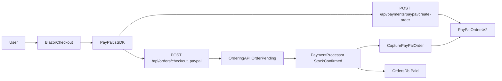

# PayPal Checkout Integration Plan

## High-level design

- **Scope**: Implement PayPal account checkout for the Blazor `WebApp` only. The .NET MAUI `ClientApp` remains unchanged.
- **Pattern**: Use PayPal JS SDK Smart Payment Buttons with Orders v2 where `createOrder` calls a backend endpoint to create a PayPal order and `onApprove` calls a backend endpoint to place the eShop order and persist the PayPal order ID; **the actual PayPal capture is initiated only after stock has been confirmed by the existing `PaymentProcessor` service**, never directly from the browser.
- **Architecture fit**: Reuse the existing order → stock validation → payment pipeline, keeping changes localized to `WebApp`, `Ordering.API`, and `PaymentProcessor`.

## Backend changes

- **Configuration & options**
  - Add PayPal config (client ID, secret, environment, API base URL) to `appsettings.json` and strongly-typed options in `PaymentProcessor` and/or `Ordering.API`, e.g. `[src/PaymentProcessor/appsettings.json](src/PaymentProcessor/appsettings.json)` and `[src/Ordering.API/appsettings.json](src/Ordering.API/appsettings.json)`.
  - Wire options via `IOptions<PayPalOptions>` in the services that will call PayPal, sourcing secrets from environment variables in production.
- **PayPal .NET Server SDK client**
  - Create a small `PayPalClient` service (e.g. `[src/Ordering.API/Infrastructure/PayPal/PayPalClient.cs](src/Ordering.API/Infrastructure/PayPal/PayPalClient.cs)` or a shared library used by both `Ordering.API` and `PaymentProcessor`) that:
    - Builds a `PaypalServerSdkClient` using `ClientCredentialsAuthModel` and the configured environment (Sandbox/Live) from `PayPalOptions`.
    - Exposes `CreateOrderAsync(amount, currency, reference)` which constructs an `OrderRequest` with `CheckoutPaymentIntent.Capture` and a single `PurchaseUnitRequest`, then calls `OrdersController.CreateOrderAsync` and returns the PayPal `order.id`.
    - Exposes `CaptureOrderAsync(paypalOrderId)` which calls `OrdersController.CaptureOrderAsync` and returns a simplified result (success flag, captured amount, key PayPal transaction IDs).
- **Checkout/payment endpoints & events**
  - Add a minimal `PayPalPaymentsApi` in `Ordering.API` (e.g. `[src/Ordering.API/Apis/PayPalPaymentsApi.cs](src/Ordering.API/Apis/PayPalPaymentsApi.cs)`) exposing:
    - `POST /api/payments/paypal/create-order` that accepts basket/order preview data (amount, currency, optional internal basketId) and returns the `paypalOrderId` from `PayPalClient.CreateOrderAsync` to the WebApp.
  - When the user completes checkout with PayPal:
    - The WebApp uses the existing order creation path in `[src/WebApp/Services/OrderingService.cs](src/WebApp/Services/OrderingService.cs)` / `[src/Ordering.API/Apis/OrdersApi.cs](src/Ordering.API/Apis/OrdersApi.cs)` to create an order with `PaymentMethod = PayPal`, `PaymentStatus = Pending`, and the `paypalOrderId` stored on the order (or in a minimal `ExternalPaymentId` field).
  - Extend the `OrderStatusChangedToStockConfirmedIntegrationEvent` (and its creation in `Ordering.API`) to include the `PaymentMethod` and `paypalOrderId` so that `PaymentProcessor` knows when and what to capture.
  - In `PaymentProcessor`, update the `OrderStatusChangedToStockConfirmedIntegrationEventHandler` in `[src/PaymentProcessor/IntegrationEvents/EventHandling/OrderStatusChangedToStockConfirmedIntegrationEventHandler.cs](src/PaymentProcessor/IntegrationEvents/EventHandling/OrderStatusChangedToStockConfirmedIntegrationEventHandler.cs)` so that:
    - For PayPal orders, it calls `PayPalClient.CaptureOrderAsync(paypalOrderId)` (or an equivalent capture helper) to capture the payment **only after** stock has been confirmed.
    - On successful capture, it publishes the existing `OrderPaymentSucceededIntegrationEvent`; on failure, it publishes `OrderPaymentFailedIntegrationEvent` and can optionally call a PayPal void/cancel endpoint.
    - If stock is rejected or the order is cancelled before reaching `StockConfirmed`, no capture is attempted; any pending PayPal order can be voided instead of captured.

## WebApp (Blazor) changes

- **Expose PayPal as payment option**
  - Update `[src/WebApp/Components/Pages/Checkout/Checkout.razor](src/WebApp/Components/Pages/Checkout/Checkout.razor)` to:
    - Add a "Pay with PayPal" option (and, if desired, deprioritize or hide the fake card fields for PayPal path).
    - Load the PayPal JS SDK script using the configured client ID (served from backend config so the client ID is not hard-coded).
- **Smart Payment Buttons integration**
  - In `Checkout.razor`, render PayPal Smart Payment Buttons and wire handlers:
    - PayPal `createOrder` callback (implemented by a `createPayPalOrder` helper): call the new `POST /api/payments/paypal/create-order` endpoint (via a small JS interop wrapper or direct `fetch`) to get the `paypalOrderId` and return it to the JS SDK.
    - PayPal `onApprove` callback (implemented by a `completePayPalCheckout` helper): call a backend endpoint such as `POST /api/orders/checkout-paypal` that uses the existing basket checkout/order creation path (e.g. `Basket.CheckoutAsync` → `OrderingService.CreateOrder()` → `OrdersApi.CreateOrderAsync`) and include the `paypalOrderId`, so the order is created with `PaymentMethod = PayPal` and `PaymentStatus = Pending` but **no PayPal capture is performed from the browser**.
  - After the `completePayPalCheckout` call returns, navigate to the existing "order completed" / orders list view; the order will move to a paid status only after `PaymentProcessor` captures the PayPal payment following stock confirmation.

## Security, configuration, and non-goals

- **Credentials & environments**
  - Store PayPal client ID/secret in configuration bound from environment variables for each environment (sandbox/production), and document required variables in README or deployment notes.
  - Ensure only the server-side `PayPalClient` uses the secret; the browser only receives the client ID via the JS SDK script URL.
- **Out of scope (kept minimal)**
  - No changes to the .NET MAUI `ClientApp`.
  - No support for credit cards, Venmo, vaulting, or advanced PayPal features beyond account checkout and capture.
  - No complex order update flows beyond marking orders as paid on successful PayPal capture.

