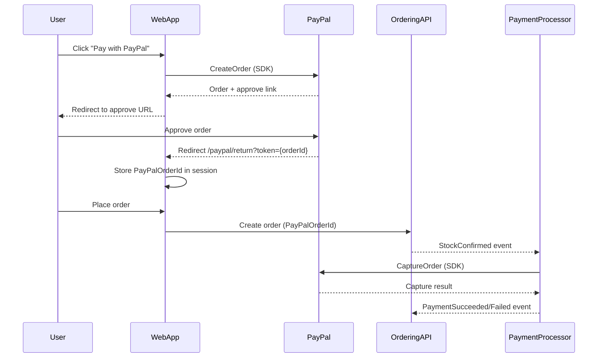

# PayPal .NET Server SDK Migration Plan

## Overview

Migrate all existing PayPal-specific infrastructure from manual `HttpClient` calls to the official PayPal .NET Server SDK (`PaypalServerSdk` 2.0.0) in both the WebApp and PaymentProcessor, while preserving the existing checkout flow, `/paypal/*` endpoints, configuration surfaces, and session-based security checks (FR-1–FR-4, FR-6–FR-12, FR-14–FR-15, FR-21). Optional requirements from `AGENTS.md` are out of scope.

---

## Phase 1 – Introduce PayPal SDK and shared configuration (must be done first)

**Goal**: Add the PayPal .NET Server SDK to the solution and centralize configuration so WebApp and PaymentProcessor both use it consistently for Sandbox/Live and client-credentials auth.

- **Implementation outline**
  - Add the `PaypalServerSdk` (Server SDK v2.0.0) NuGet package to:
    - `src/WebApp/eShop.WebApp.csproj` (or equivalent WebApp project).
    - `src/PaymentProcessor/PaymentProcessor.csproj`.
  - Define a small internal options-mapping helper in each process to map existing config into SDK settings:
    - WebApp: map `PayPal:ClientId`, `PayPal:ClientSecret`, `PayPal:Environment` (e.g. `Sandbox`/`Live`) from `appsettings` into `ClientCredentialsAuthModel` and `PaypalServerSdk.Standard.Environment`.
    - PaymentProcessor: map `PaymentOptions.PayPalClientId`, `PayPalClientSecret`, `PayPalEnvironment` into the same SDK constructs.
  - Register a singleton `PaypalServerSdkClient` in DI for each process, configured via the builder:
    - Use `.ClientCredentialsAuth(new ClientCredentialsAuthModel.Builder(clientId, clientSecret).Build())`.
    - Use `.Environment(PaypalServerSdk.Standard.Environment.Sandbox | Production)` based on config, defaulting to Sandbox for non-production (FR-6).
    - Configure logging so sensitive headers are masked and request/response bodies are only logged at appropriate levels to avoid credential leakage (FR-10).
    - Configure HTTP timeout via `.HttpClientConfig(config => config.Timeout(TimeSpan.FromSeconds(X)))` to satisfy FR-14 (bounded call duration).
  - If per-AGENTS retry behavior is desired beyond what the SDK provides, plan to wrap calls in Polly policies at the application level (Phase 4), not inside the SDK client itself.
- **Delegation / parallelization**
  - **Delegate?** Good candidate for a single infrastructure-focused agent who understands DI and configuration.
  - **Parallelizable?** Mostly self-contained but should complete before Phases 2 and 3 start, because those phases depend on the DI-registered `PaypalServerSdkClient`.
- **Decision points for you**
  - **Timeout value**: choose a default (e.g. 30–60 seconds) that balances user experience and long-running captures (FR-14).
  - **Log verbosity**: decide whether to log request/response bodies for PayPal calls in non-production; for production, recommended to log only metadata and masked headers.
  - **Retry strategy**: confirm whether you want explicit retry policies (e.g. up to 2–3 attempts with exponential backoff and jitter) implemented via Polly around SDK calls.

---

## Phase 2 – Migrate WebApp PayPal create-order flow to SDK

**Goal**: Replace manual OAuth + Orders create calls in the WebApp with the PayPal SDK, while keeping `/paypal/pay`, `/paypal/return`, `/paypal/cancel` endpoints, query params, redirect URIs, and session validation exactly as they are (FR-1–FR-3, FR-6–FR-9, FR-12, FR-15).

- **Key files**
  - `[src/WebApp/PayPal/PayPalEndpoints.cs](src/WebApp/PayPal/PayPalEndpoints.cs)` – current manual token + create-order logic and E2E test-mode bypass.
  - `[src/WebApp/PayPal/PayPalSessionKeys.cs](src/WebApp/PayPal/PayPalSessionKeys.cs)` – session key for `PayPalOrderId`.
  - `[src/WebApp/Services/BasketPricingService.cs](src/WebApp/Services/BasketPricingService.cs)` and `[src/WebApp/Services/BasketState.cs](src/WebApp/Services/BasketState.cs)` – basket total and checkout info, including `PayPalOrderId`.
  - `[src/WebApp/Components/Pages/Checkout/Checkout.razor](src/WebApp/Components/Pages/Checkout/Checkout.razor)` – form fields, `PayPalOrderId` handling, and return/session validation.
- **Implementation outline**
  - Introduce a small WebApp-level abstraction like `IPayPalCheckoutService` that wraps the SDK’s `OrdersController`:
    - Methods such as `Task<(string orderId, Uri approveLink)> CreateOrderAsync(decimal total, string currency, Uri returnUrl, Uri cancelUrl, CancellationToken ct)`.
    - Internally, construct an `OrderRequest` with `Intent = CheckoutPaymentIntent.Capture`, one `PurchaseUnitRequest` containing the basket total and `CurrencyCode` from config (FR-2), and the appropriate application-context return/cancel URLs.
    - Call `ordersController.CreateOrderAsync` and extract the PayPal order ID and the `rel == "approve"` link from the response.
  - Refactor `PayPalEndpoints.CreateOrderAndRedirectAsync` to:
    - Use `BasketPricingService` to compute total as today.
    - Use `IPayPalCheckoutService` (or `PaypalServerSdkClient` directly) instead of manual `HttpClient` + JSON for OAuth and order creation.
    - On success, store the PayPal order ID in session using `PayPalSessionKeys.OrderId` (FR-9) and redirect to the approval URL.
    - Preserve the `PayPal:E2ETestMode` branch so the new SDK path is skipped when that flag is set, and the test-mode behavior (/paypal/return then /checkout?paid=1) stays identical.
  - Keep `/paypal/return` and `/paypal/cancel` endpoints’ behavior unchanged:
    - `/paypal/return` must still validate the `token` (or equivalent) against the session-stored ID and only mark the checkout as “paid” if they match (FR-3, FR-9).
    - `/paypal/cancel` must still redirect back to checkout with the same query parameters and messaging.
  - Ensure any errors from `CreateOrderAsync` (e.g. `ApiException`, non-2xx status codes) are handled and logged with sufficient context (basket ID, user, amount, PayPal status) and surfaced as the same user-facing error/redirect as the current implementation (FR-12).
- **Delegation / parallelization**
  - **Delegate?** Strong candidate for a WebApp-focused agent familiar with minimal APIs and Blazor.
  - **Parallelizable?** Can proceed in parallel with Phase 3 (PaymentProcessor migration) once Phase 1 has established the SDK client registration.
- **Decision points for you**
  - **Abstraction level**: decide whether you want a thin wrapper (`IPayPalCheckoutService`) or to inject `PaypalServerSdkClient` directly into endpoints. Wrapper is recommended for testability and to avoid scattering SDK-specific types across the WebApp.
  - **Order fields**: confirm whether to match the existing order description/reference IDs exactly (for diagnostics) or keep the SDK usage minimal (only amount/currency). The plan assumes you’ll mirror current semantics as much as practical.

---

## Phase 3 – Migrate PaymentProcessor PayPal capture flow to SDK

**Goal**: Replace manual OAuth + capture HTTP calls in the PaymentProcessor with the PayPal SDK capture APIs, keeping the capture-on-stock-confirmed behavior and integration events unchanged (FR-1, FR-4, FR-6–FR-8, FR-10–FR-12, FR-14–FR-15, FR-21).

- **Key files**
  - `[src/PaymentProcessor/PayPalPaymentService.cs](src/PaymentProcessor/PayPalPaymentService.cs)` – current token + capture logic using `HttpClient`.
  - `[src/PaymentProcessor/PaymentOptions.cs](src/PaymentProcessor/PaymentOptions.cs)` – `UsePayPal`, `PayPalClientId`, `PayPalClientSecret`, `PayPalEnvironment`, `PaymentSucceeded`, `CurrencyCode`.
  - `[src/PaymentProcessor/OrderingApiClient.cs](src/PaymentProcessor/OrderingApiClient.cs)` – source of `OrderDto.PayPalOrderId`.
  - `[src/PaymentProcessor/IntegrationEvents/EventHandling/OrderStatusChangedToStockConfirmedIntegrationEventHandler.cs](src/PaymentProcessor/IntegrationEvents/EventHandling/OrderStatusChangedToStockConfirmedIntegrationEventHandler.cs)` – caller of `IPaymentService.ProcessPaymentAsync`.
  - `[src/PaymentProcessor/Program.cs](src/PaymentProcessor/Program.cs)` – DI registration of `IPaymentService` and the PayPal `HttpClient`.
- **Implementation outline**
  - Introduce a PaymentProcessor-level abstraction such as `IPayPalCaptureService` that uses the SDK’s `OrdersController`:
    - Method like `Task<bool> CaptureOrderAsync(string paypalOrderId, CancellationToken ct)` that returns success/failure; optionally also returns status text/details for logging.
    - Internally, construct a `CaptureOrderInput` with the PayPal order ID and call `ordersController.CaptureOrderAsync`.
    - Consider `Prefer = "return=minimal"` vs `"return=representation"` depending on how much detail you want for logging.
  - Refactor `PayPalPaymentService.ProcessPaymentAsync` to:
    - Preserve existing preconditions: only attempt capture when `PaymentOptions.UsePayPal` is true and the retrieved order has a non-empty `PayPalOrderId`; otherwise fall back to simulated `PaymentSucceeded` behavior as today (even though it’s optional, this keeps current behavior).
    - Call `IPayPalCaptureService.CaptureOrderAsync` instead of manual OAuth + capture routes.
    - Interpret the SDK response so that a completed capture maps to the existing notion of “payment succeeded” (e.g. status `COMPLETED`) and anything else maps to “failed”, logging relevant details but not sensitive data (FR-10, FR-12).
    - Publish `OrderPaymentSucceededIntegrationEvent` / `OrderPaymentFailedIntegrationEvent` with the same payloads as before (FR-4, FR-11, FR-15).
  - Update DI in `Program.cs`:
    - Remove or de-emphasize the dedicated PayPal `HttpClient` registration, as the SDK manages HTTP internally.
    - Register `IPayPalCaptureService` and ensure it receives the configured `PaypalServerSdkClient` from Phase 1.
- **Delegation / parallelization**
  - **Delegate?** Good candidate for a backend/integration-focused agent comfortable with messaging and domain events.
  - **Parallelizable?** Can run in parallel with Phase 2 (WebApp migration) once Phase 1’s SDK and configuration wiring are done.
- **Decision points for you**
  - **Capture response detail**: choose whether the service should log full `Order`/capture details (with masking) or only high-level status, considering observability vs log volume.
  - **Error classification**: decide how strictly to treat soft failures (e.g. 422 validation vs transient 5xx) in terms of retry vs immediate integration-event failure; Phase 4 will implement the chosen policy.

---

## Phase 4 – Error handling, observability, and resilience

**Goal**: Align error handling and logging with the new SDK-based flows while meeting FR-12 and FR-14 (clear outcomes, sane retries/timeouts, and no hangs).

- **Implementation outline**
  - Standardize how `ApiException` and other SDK errors are handled in both WebApp and PaymentProcessor:
    - Map them to existing user-visible error pages or redirects (e.g. checkout error page for create-order failures; payment-failed path for capture failures).
    - Log errors with context: PayPal order ID, eShop order ID, user/basket ID, currency/amount, and HTTP status/PayPal error codes.
  - Implement bounded timeouts using the SDK’s `HttpClientConfig` builder for both processes (if not fully configured in Phase 1).
  - If you opt into explicit retries, wrap SDK calls in small helper methods that apply a Polly policy (e.g. transient HTTP and 5xx statuses) with exponential backoff and an overall deadline to avoid unbounded retries.
  - Verify that no logs include client IDs, client secrets, or OAuth tokens (FR-10).
- **Delegation / parallelization**
  - **Delegate?** Could be handled by the same agents working on Phases 2 and 3 or by a separate cross-cutting concerns agent.
  - **Parallelizable?** Much of this can be implemented alongside Phases 2 and 3, but final tuning and validation should be done after basic SDK flows are working.
- **Decision points for you**
  - **Retry policy shape**: confirm the maximum number of retries, backoff schedule, and which error classes are considered retryable vs fatal.
  - **Minimum logging baseline**: agree on what fields are mandatory in logs for PayPal failures to support production diagnostics.

---

## Phase 5 – Testing and validation

**Goal**: Ensure that the migrated implementation meets the non-optional product requirements and that the existing E2E and unit tests are updated accordingly (FR-1–FR-4, FR-12, FR-14, FR-15, FR-21).

- **Implementation outline**
  - Update unit tests for `PayPalPaymentService` (e.g. `[tests/PaymentProcessor.UnitTests/PayPalPaymentServiceTests.cs](tests/PaymentProcessor.UnitTests/PayPalPaymentServiceTests.cs)`) to target the new `IPayPalCaptureService` abstraction instead of mocking raw `HttpClient`:
    - Provide fakes/mocks for the capture service to simulate success, failure, and exception scenarios.
    - Verify that integration events emitted match existing expectations.
  - Add focused unit/integration tests (if not already present) for the WebApp `IPayPalCheckoutService` or endpoints that:
    - Confirm that a PayPal order is created with the correct amount and currency.
    - Verify that the approval URL is extracted correctly and that session stores the order ID.
  - Keep the Playwright test `[e2e/PayPalCheckoutTest.spec.ts](e2e/PayPalCheckoutTest.spec.ts)` intact, ensuring `ESHOP_PAYPAL_E2E_TEST_MODE` continues to bypass real PayPal and the flow remains unchanged.
  - Run end-to-end tests against Sandbox:
    - Create PayPal order from checkout.
    - Return with valid session.
    - Place order with `PayPalOrderId`.
    - Confirm PaymentProcessor captures successfully and emits the same success/failure events as before (FR-21).
- **Delegation / parallelization**
  - **Delegate?** Can be a QA/automation-focused agent or owned by the same engineers implementing code changes.
  - **Parallelizable?** Unit test updates for PaymentProcessor can start once Phase 3’s abstractions are in place; E2E validation should be last to confirm the whole flow.
- **Decision points for you**
  - **Test depth vs time**: decide how much additional coverage (e.g. negative-path E2E scenarios like canceled PayPal approvals) you want beyond the mandatory happy-path FR-21 tests.

---

## Natural breakpoints summary

- **Breakpoint A – After Phase 1**: SDK packages added and `PaypalServerSdkClient` registered with configuration in both WebApp and PaymentProcessor.
  - **Good handoff**: from a platform/infrastructure agent to feature-focused agents handling WebApp and PaymentProcessor migrations.
- **Breakpoint B – After Phase 2 and Phase 3 (in parallel)**: WebApp create-order and PaymentProcessor capture flows both use the SDK and pass basic smoke tests.
  - **Good handoff**: to a cross-cutting agent for resilience/logging and a QA agent for tests.
- **Breakpoint C – After Phase 4 and 5**: Error handling, timeouts, and tests are all in place; ready for Sandbox and (eventual) Live rollout.

These breakpoints are natural places to decide whether to spin up additional agents, run phases in parallel, or perform reviews before proceeding.