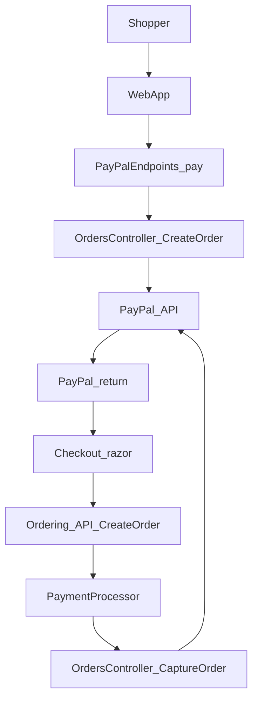

# PayPal Server SDK Migration Plan

IMPORTANT NOTE: At the end of every step or break, stop and ask the user whether to continue or change the plan.

## 1. Context and Objectives

- **Current flow**: WebApp creates a PayPal order (`/paypal/pay`), redirects to PayPal for approval, receives return at `/paypal/return`, validates the PayPal order ID in `Checkout.razor`, creates an order with `PayPalOrderId`, and a separate PaymentProcessor captures the order after stock confirmation.
- **Key integration points**:
  - **WebApp**: `[src/WebApp/PayPal/PayPalEndpoints.cs](src/WebApp/PayPal/PayPalEndpoints.cs)`, `[src/WebApp/Components/Pages/Checkout/Checkout.razor](src/WebApp/Components/Pages/Checkout/Checkout.razor)`, `[src/WebApp/Services/BasketCheckoutInfo.cs](src/WebApp/Services/BasketCheckoutInfo.cs)`
  - **PaymentProcessor**: `[src/PaymentProcessor/PayPalPaymentService.cs](src/PaymentProcessor/PayPalPaymentService.cs)`, `[src/PaymentProcessor/PaymentOptions.cs](src/PaymentProcessor/PaymentOptions.cs)`, `OrderStatusChangedToStockConfirmedIntegrationEventHandler` in `[src/PaymentProcessor/IntegrationEvents/EventHandling/OrderStatusChangedToStockConfirmedIntegrationEventHandler.cs](src/PaymentProcessor/IntegrationEvents/EventHandling/OrderStatusChangedToStockConfirmedIntegrationEventHandler.cs)`
  - **Ordering**: `[src/Ordering.API/Application/Commands/CreateOrderCommand.cs](src/Ordering.API/Application/Commands/CreateOrderCommand.cs)` carries `PayPalOrderId`.
- **Target state**: Use `PaypalServerSdkClient` and `OrdersController.CreateOrderAsync` / `OrdersController.CaptureOrderAsync` (from PayPalServerSDK) instead of custom `HttpClient` calls, while satisfying non-optional requirements in `AGENTS.md` (FR-1..FR-4, FR-6..FR-12, FR-14, FR-15, FR-21).

- **Natural break**: This context section is informational only; no code changes. Can be reused by all agents.

---

## 2. Introduce PayPalServerSDK Dependencies and Shared Configuration

- **Scope**: Add SDK dependency, configuration objects, and DI wiring in both WebApp and PaymentProcessor without changing any existing behavior yet.
- **Delegation**: Good standalone task for one agent; once complete, WebApp and PaymentProcessor migrations can proceed largely in parallel.
- **Parallelization**: Within this step, WebApp and PaymentProcessor wiring can be done by different agents if coordination on configuration naming is clear.
- **Decisions**:
  - **D1**: Keep **two separate SDK usages** (one per project, as today) and NOT introducing a shared internal library (default: keep two usages to match `AGENTS.md` note and reduce scope).
  - **D2**: Use simple **configuration key names** for SDK-specific options (timeouts, logging levels) while preserving existing `PayPal:*` and `PaymentOptions` surface. For example, `Timeout`, `LoggingLevel`.

**Planned actions**

1. **Add SDK package references** (no behavior change):
  - Add `PayPalServerSDK` NuGet to WebApp and PaymentProcessor projects.
2. **Define PayPal SDK options types**:
  - WebApp: introduce `PayPalSdkOptions` bound from existing `PayPal:*` section (client ID, secret, environment, currency, redirect URLs, E2ETestMode).
  - PaymentProcessor: extend or map existing `PaymentOptions` (`UsePayPal`, `PayPalClientId`, `PayPalClientSecret`, `PayPalEnvironment`, `CurrencyCode`) into a `PaymentProcessorPayPalSdkOptions` used to build the SDK client.
3. **Map environment values**:
  - Map `PayPal:Environment` and `PaymentOptions.PayPalEnvironment` values (`Sandbox`/`Live`) to `PaypalServerSdk.Standard.Environment.Sandbox` / `.Live`.
  - Preserve default Sandbox behavior for non-prod (FR-6).
4. **Register `PaypalServerSdkClient` in DI**:
  - For each project, register a singleton `PaypalServerSdkClient` in `Program.cs` using `ClientCredentialsAuthModel` with ID/secret from options and mapped environment.
  - Expose `OrdersController` via DI (or via the client where needed).
5. **Configure logging and timeouts centrally**:
  - Configure SDK logging via `LoggingConfig` while ensuring no client secret or sensitive values are logged (FR-10).
  - Set sensible HTTP timeouts (e.g., 10–30s) at client level to avoid hanging calls (FR-14).

**Break to validate**

- Confirm build succeeds and that applications start without using the SDK yet.
- Verify via configuration dumps/logs that PayPal environment and credentials are wired but not logged in plaintext.

---

## 3. Migrate WebApp Create-Order Flow to PayPalServerSDK

- **Scope**: Replace manual OAuth + `/v2/checkout/orders` HTTP calls in WebApp with `OrdersController.CreateOrderAsync`, preserve endpoints and session behavior.
- **Delegation**: Can be assigned to a WebApp-focused agent once step 2 is done.
- **Parallelization**: Can be developed in parallel with PaymentProcessor capture migration (step 4) after SDK client wiring is complete.
- **Decisions**:
  - **D3**: Keep current `**Prefer` header behavior** (e.g., `return=minimal`); default is to keep current minimal behavior to reduce diff.
  - **D4**: Avoid additional logging (e.g., PayPal `Order.Id`, `Status`, key link URLs) at INFO level.

**Planned actions**

1. **Preserve public endpoint contracts** (FR-1, FR-2, FR-3, FR-15):
  - Keep `/paypal/pay`, `/paypal/return`, and `/paypal/cancel` routes, HTTP methods, query parameters, and redirect URLs unchanged in `[src/WebApp/PayPal/PayPalEndpoints.cs](src/WebApp/PayPal/PayPalEndpoints.cs)`.
  - Ensure `/paypal/return` still redirects to checkout with `paid=1&paypalOrderId={token}`.
2. **Retain E2E test mode path** (FR-1, FR-2, FR-21):
  - Leave the existing E2E test mode short-circuit logic active: when `PayPal:E2ETestMode` (mapped from `ESHOP_PAYPAL_E2E_TEST_MODE`) is true, **do not call the SDK**; instead, generate a fake order ID and proceed as today.
3. **Refactor `/paypal/pay` to use `OrdersController.CreateOrderAsync**`:
  - Replace manual `HttpClient` token + Orders calls with construction of a `CreateOrderInput` using the basket total and currency from `BasketPricingService` and config.
  - Extract basket amount and currency code exactly as today, ensuring the same rounding/precision rules (FR-2).
  - Use `CheckoutPaymentIntent.Capture` and at least one `PurchaseUnitRequest` matching the current single-unit structure.
  - Store `createdOrder.Id` into session under `PayPalSessionKeys.OrderId`.
  - Identify the approval link (`rel == "approve"`) from `createdOrder.Links` and redirect to it (maintaining redirect semantics).
4. **Ensure session-based validation stays unchanged** (FR-9):
  - Do not modify `Checkout.razor` session validation logic beyond any necessary renames; the validation of `paypalOrderId` from query vs. session-stored value must remain intact.
5. **Error handling and logging for create order** (FR-12, FR-14):
  - Wrap calls to `CreateOrderAsync` in `try/catch` for `ApiException` / `ErrorException`.
  - Log PayPal `DebugId`, status code, and high-level message but **never client secret or raw auth headers** (FR-10).
  - Translate failures into the same user-facing behavior as today (e.g., error page or redirect with error indication) so UX does not regress.

**Break to validate**

- Run WebApp-only manual tests (Sandbox or E2E mode off) to verify:
  - Basket total and currency sent to PayPal match previous implementation.
  - Session stores the PayPal order ID and `/checkout` receives and validates `paypalOrderId` correctly.
  - Redirect URLs and user-visible flow are unchanged.

---

## 4. Migrate PaymentProcessor Capture Flow to PayPalServerSDK

- **Scope**: Replace manual OAuth + `/v2/checkout/orders/{id}/capture` HTTP calls in `[src/PaymentProcessor/PayPalPaymentService.cs](src/PaymentProcessor/PayPalPaymentService.cs)` with `OrdersController.CaptureOrderAsync`, preserving stock confirmation semantics and integration events.
- **Delegation**: Can be assigned to a backend/payment-focused agent; largely independent once step 2 is complete.
- **Parallelization**: Can be done in parallel with WebApp migration (step 3); both only depend on SDK client wiring.
- **Decisions for you**:
  - **D5**: Choose **retry policy** (max attempts, backoff) for capture in case of transient failures (e.g., 3 attempts with exponential backoff vs. a simpler 1–2 retries).
  - **D6**: Confirm mapping rules from PayPal capture status to domain events (e.g., is only `COMPLETED` considered success, or do we treat some intermediate statuses specially).

**Planned actions**

1. **Preserve service boundaries and capture timing** (FR-1, FR-4, FR-11):
  - Leave `OrderStatusChangedToStockConfirmedIntegrationEventHandler` behavior intact: it remains the only trigger for PayPal capture.
  - `PayPalPaymentService` continues to be the only component that talks to PayPal for capture.
2. **Preserve simulated mode when PayPal is disabled** (FR-4, FR-5, FR-15):
  - Keep logic that short-circuits to `PaymentOptions.PaymentSucceeded` when `UsePayPal` is false or credentials are missing.
  - Ensure no SDK calls are made in this simulated path.
3. **Refactor to use `OrdersController.CaptureOrderAsync**`:
  - Replace manual `HttpClient` OAuth + capture calls with `CaptureOrderInput` and `CaptureOrderAsync` on the injected `OrdersController`.
  - Use `order.PayPalOrderId` from the loaded order; do not change how it is populated.
  - Map capture result: treat status `COMPLETED` as success and keep existing semantics for non-success statuses (unless you adjust per D6).
4. **Error handling, retries, and timeouts** (FR-12, FR-14):
  - Wrap capture in `try/catch` for `ApiException` / `ErrorException`; log `DebugId`, error name/message, and relevant details.
  - Implement a retry policy for transient failures (likely via a small wrapper or policy around the SDK call) using a bounded retry count and backoff.
  - Ensure overall handler does not block indefinitely; obey configured timeouts.
5. **Integration events**:
  - Keep publishing `OrderPaymentSucceededIntegrationEvent` or `OrderPaymentFailedIntegrationEvent` with the same conditions and payloads as today so downstream services remain unaffected (FR-4, FR-15).

**Break to validate**

- Run PaymentProcessor unit tests (updating mocks for SDK usage) and local manual tests to verify:
  - Orders with a valid `PayPalOrderId` are captured successfully and publish success events.
  - Invalid IDs or failed captures publish failure events as before.
  - Simulated mode still behaves as configured without touching PayPal.

---

## 5. Cross-Cutting Security, Observability, and Configuration Checks

- **Scope**: Ensure the new integration does not weaken security and that logging/metrics are good enough for operations.
- **Delegation**: Good cross-cutting review task; can be handled by a senior engineer or security-conscious agent after steps 2–4 are implemented.
- **Parallelization**: Some of this can happen in parallel with implementation but final review should happen after migrations are done.
- **Decisions for you**:
  - **D7**: Decide on **log levels and fields** for PayPal interactions (INFO vs. DEBUG, which contextual fields are allowed).
  - **D8**: Decide whether to add any **additional metrics** (e.g., capture latency, failure rates) beyond logging.

**Planned actions**

1. **Security checks** (FR-9, FR-10, FR-11):
  - Confirm that session-based validation of `PayPalOrderId` is unchanged and still enforced only in the web flow.
  - Verify no logs include client secret or raw auth tokens; rely on SDK logging configuration to avoid sensitive header/body fields.
  - Ensure there are no new code paths that call capture outside of the PaymentProcessor’s order/stock-confirmed flow.
2. **Configuration verification** (FR-6, FR-7, FR-8):
  - Validate that Sandbox/Live environment selection works end-to-end in both WebApp and PaymentProcessor.
  - Confirm that existing configuration entry points (`PayPal:*`, `PaymentOptions`) remain the only public surface for credentials and environment configuration.
3. **Error handling and robustness** (FR-12, FR-14):
  - Review all `ApiException` handling paths to ensure user-visible behavior matches or improves upon current flows.
  - Confirm that timeouts and retries are correctly bounded and that failures surface clearly in logs with enough context (order ID, basket summary, HTTP status, PayPal `DebugId`).

**Break to validate**

- Perform a code-level and configuration review; run through a few forced-failure scenarios (e.g., invalid client secret, network outage) in a non-production environment and inspect logs.

---

## 6. Testing and Validation

- **Scope**: Update and extend automated tests and run end-to-end validation to ensure parity with the current behavior (FR-21).
- **Delegation**: Can be led by a QA-focused or test-heavy agent, using implementation changes in steps 3–4.
- **Parallelization**: Unit-test updates can be done alongside implementation; E2E validation should run after main changes are in place.
- **Decisions for you**:
  - **D9**: Decide on any **additional test cases** beyond current coverage (e.g., dedicated Sandbox runs, chaos tests on PaymentProcessor).

**Planned actions**

1. **Unit tests**:
  - Update `[tests/PaymentProcessor.UnitTests/PayPalPaymentServiceTests.cs](tests/PaymentProcessor.UnitTests/PayPalPaymentServiceTests.cs)` to mock `OrdersController` / SDK responses instead of raw `HttpClient`.
  - Add tests to cover new error-handling paths with `ApiException` / `ErrorException`.
2. **WebApp tests**:
  - Add or update unit/integration tests around `/paypal/pay` to assert that:
    - Basket totals and currency codes are passed correctly into the SDK request models.
    - Session stores the PayPal order ID and that redirect uses the approval link from the SDK response.
3. **E2E tests**:
  - Ensure existing Playwright E2E test(s) covering PayPal checkout still pass when `ESHOP_PAYPAL_E2E_TEST_MODE` is enabled (FR-21).
  - Optionally add a non-E2E-mode Sandbox test run (manual or automated) to verify real PayPal interactions with the SDK.
4. **Regression checklist**:
  - Validate the full flow: create PayPal order → approve → return → place order → capture → payment events, in both Sandbox and E2E test modes.

**Break to validate**

- Require green unit tests for PaymentProcessor and WebApp, passing E2E tests, and at least one manual Sandbox end-to-end run before considering the migration complete.

---

## 7. Rollout and Guarded Enablement

- **Scope**: Plan a safe rollout so that enabling the new SDK-backed integration can be controlled and reversed if issues are found.
- **Delegation**: Ops- or SRE-focused agent can own this phase, with input from developers.
- **Parallelization**: Configuration and deployment planning can run in parallel with late-stage testing.
- **Decisions for you**:
  - **D10**: Decide on the **rollout strategy** (feature flag vs. environment-based rollout vs. single big-bang switch).

**Planned actions**

1. **Toggle strategy**:
  - Use existing `UsePayPal` and environment config to gate the new SDK-backed paths, ensuring that you can disable PayPal entirely if needed without reverting code.
2. **Release plan**:
  - Roll out to a non-production environment first (Sandbox with real PayPal) and monitor logs and metrics.
  - After confidence is gained, enable in production with clear monitoring of capture failures and checkout errors.
3. **Fallback plan**:
  - Document how to quickly revert to simulated mode (or disable PayPal) using configuration if unexpected SDK-related issues arise.

**Final completion criteria**

- All non-optional requirements in `AGENTS.md` are satisfied:
  - Same user-visible checkout flow and URLs (FR-1..FR-4, FR-15).
  - Sandbox/Live configuration and credential handling preserved and secured (FR-6..FR-8, FR-9..FR-11).
  - Robust error handling, logging, and bounded retries/timeouts (FR-12, FR-14).
  - End-to-end tests for PayPal checkout and capture are green (FR-21).

